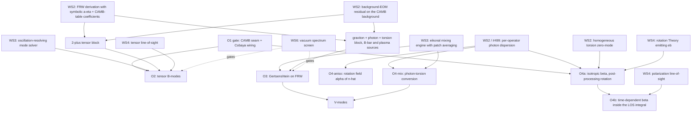

# Observable-ladder feasibility study (H2)

**Executed:** 2026-08-30. **Status:** complete. **Scope:** rungs O1–O4 of the observable
ladder in `docs/COSMOLOGY_PROGRAM.md` — what must exist, what each rung must reproduce,
what it costs, what could invalidate it, and which likelihoods exist — followed by a
recommended ordering for O2–O4.

**Inputs.** H1's TorC audit (`torc_pipeline_audit.md`), H7's spectator scope
(`spectator_route.md`), the O4 foundation (`birefringence_notes.md`), the primer
(`primer.md`), the local `literature/` sources, and a verified survey of the Cobaya /
CAMB / likelihood landscape (2026-08-30, versions in §6). The O3 magnetic-field question
grew large enough to warrant its own companion document,
[`magnetic_field_background.md`](magnetic_field_background.md).

**This report does not restate the companion documents.** Where a mechanism, trap, or
convention is already recorded there, it is cited and used.

---

## 0. Two findings that change the program's picture

### 0.1 O3 is not the same solver problem as O2

Both rungs look alike — "a small linear system per mode, integrated over cosmic history" —
but they differ in *how many oscillations the mode makes*, which is exactly what a solver
must resolve.

- **O2** evolves gravitational waves at CMB scales: comoving `k ~ 10⁻⁴–1 Mpc⁻¹` against a
  conformal age `η₀ ≈ 1.4×10⁴ Mpc`, so a mode oscillates `kη₀/2π ~ 1–10³` times. A
  step-by-step integrator (Magnus, with WKB switching for the fastest modes) can follow
  every oscillation. This is the standard Boltzmann-code tensor problem, and it is what
  WS3's ladder (`handoffs/H3.md`) is designed around.
- **O3** evolves *photons at CMB frequencies*: `ν ~ 100 GHz` is comoving
  `k ≈ 6.5×10²⁵ Mpc⁻¹`, some `10²⁹` oscillations between recombination and today. No
  integrator steps through that. Every paper in this literature (Cembranos
  arXiv:2302.08186; Domcke & Garcia-Cely arXiv:2006.01161; He et al. arXiv:2312.17636;
  Kushwaha & Jain arXiv:2502.12517) removes the carrier analytically — writing the field
  as `e^{−iωη} ×` a slowly varying amplitude — and integrates only the **amplitude
  mixing**, governed by a small matrix `M(η)` whose entries (`κB/2`, plasma detuning
  `ω_pl²/2ω`, Hubble damping `iℋ`) are ~30 orders below `ω`. And because the plasma makes
  `l_osc ≪ 1 pc ≪ λ_B ~ Mpc`, they then **average over coherence patches** and accumulate
  a rate along the line of sight rather than resolving even the mixing oscillation.

So O2 needs an oscillation-resolving ODE solver; O3 needs an amplitude-equation (eikonal)
formulation plus a patch-averaged rate integral. The second-order system TIDAL derives is
the starting point for both, but the reduction to the amplitude equation is an extra
*symbolic* step for O3, and the two engines have different shapes.

**This is an input to WS3's solver research, not a conclusion of it.** `handoffs/H3.md`
currently frames one solver ladder; it should be extended to design for both kinds.

### 0.2 O4 is three channels with different prerequisites

Parity-odd torsion–photon couplings alone — no background of any kind — already give two
observables:

- **O4-aniso:** a torsion perturbation `δS(k ≠ 0, η)` produces a *rotation field* `α(n̂)`
  with its own power spectrum `C_L^{αα}` (anisotropic birefringence, amplitude `A_CB`).
- **O4-mix:** the same couplings mix photons with torsion modes — conversion, sharing
  O3's machinery, and the route to circular polarization (V-modes).

The *isotropic* rotation `β` is the `k = 0` mode of that same field, so **O4-iso**
additionally needs a homogeneous mode `S₀(η) ≠ 0`. In the spectator framing that is a
**zero-mode spectator field**: a homogeneous torsion component with `ρ ≪ ρ_crit` evolved
by its own equation of motion on CAMB's `a(η)` — structurally identical to the axion in
axion-birefringence models, and fully inside the spectator limit. (A condensate background
of the TorC type would also do it, but that requires computing a new background expansion
and is **parked**; `literature/2003.02690/` remains the map of which PGT classes have a
natural homogeneous torsion mode.)

The practical consequence: the channels that need nothing but couplings (O4-aniso,
O4-mix) are available as soon as the derivation exists, while the channel with the 4.8σ
signal (O4-iso) carries one extra modeling ingredient.

---

## 1. O1 — fixed-table pass-through (a gate, not physics)

H1 narrowed O1 to a plumbing gate (§6, decision R1): one `(a, ρ, P)` table generated
offline, pushed through an optional tabulated-background hook, checked against a reference
CAMB build. **No TorC physics enters our package and no background is derived by us.**

### What must exist

| Capability | WS | Critical path? |
| --- | --- | --- |
| Own CAMB fork off the `2.0.3` tag with the `(ρ, P)`-table dark-energy model re-applied: optional `P` output on `BackgroundDensityAndPressure`, `DarkEnergyPressure{,PPF}.f90`, the two `gpres` sites in `equations.f90`, a **new** Python accessor (do not widen `get_dark_energy_rho_w`) | WS5 (#494), GH #498 | yes |
| A Cobaya `Theory` providing a `dark_energy` product `{a_rho, a_p, rho, p}`, consumed by the CAMB theory via `must_provide → {"dark_energy": None}` and set *before* cosmology (`cosmomc_theta` solving depends on the background) — the wiring template is H1 §3.1 | WS5 | yes |
| One offline table: run Zenodo's `TorC_rhopa.py` unmodified at `(ϖ_r, Ω_Λ) = (0.8, 0.685)`, 10,000-point `logspace` grid in `a`, normalized so `ρ(1) = 1` | data prep | yes |
| `planck_clik` NaN → `−inf` guard as a flagged rejection path (H1 §3.3) | WS5 | no |

### Known-answer targets

| Check | Target | Tolerance |
| --- | --- | --- |
| Constant table with `P = −ρ` | stock ΛCDM `C_ℓ` from unpatched CAMB | machine precision |
| `TorC_rhopa.py` table → our hook → CAMB | the same table fed to `slegner/CAMB@2fb908af` through its `rhoafile`/`Pafile` ini route (H1 §2.3): `H(a)` and `C_ℓ` | solver tolerance, `≲10⁻⁴` |
| Same table through **stock** `set_w_a_table` | agrees with the patched path — valid at this point because the fiducial has 0 sign changes and `max|w| = 0.998` (H1 §8) | solver tolerance |
| Regression at `ϖ_r = 1.05` | the `w(a)` route provably breaks (`max\|w\| = 2.7×10⁴`), the `(ρ, P)` route runs | qualitative |
| Held, not gated | the four archived evidences (H1 §5.3), e.g. `TorC_Planck_Lense` `log Z = −1447.31778 ± 0.22115` | O1b only |

The `w(a)` cross-check is free and diagnostic: disagreement localizes a bug in our
re-apply rather than in the physics.

### Cost

~309 lines of Fortran plus ~115 lines of Python surface, re-applied (H1 §7.1); the rest of
the fork's 21-file footprint is signature churn. Per likelihood call the cost *is* CAMB
(< 1 s). Three new components: the fork, the provider `Theory`, the table script. Users of
the optional path need a Fortran toolchain; the default install does not.

### What could invalidate it

Nothing physical — that is the point of scoping it this way. Risks are mechanical: a
re-apply bug (caught by the cross-check), the PPF closure supporting `cs2 = 1` only, and
exotic backgrounds reaching the likelihood as NaN.

### Likelihoods

Built-in and sufficient: `planck_2018_lowl.TT`, `planck_2018_lowl.EE`,
`planck_2018_highl_plik.TTTEEE`, `planck_2018_lensing.clik` — exactly the set recovered
from TorC's `.paramnames` (H1 §5.3), plus SH0ES as a Gaussian on `H_0` if wanted. No
sampler run is needed for the gate.

---

## 2. O2 — spectator tensor propagation → B-modes

The first genuinely new result: the tensor sector's perturbations evolved on CAMB's ΛCDM
background, with torsion coupled in, projected to `C_ℓ^{BB}`.

### What must exist

| Capability | WS | Critical path? |
| --- | --- | --- |
| FRW derivation mode: the 2⁺ (tensor) sector derived with `a(η)`, `ℋ(η)` left as unspecified background functions, in conformal time; output = the coupled `(h_ij, torsion 2⁺)` block | WS2 (#491) | yes |
| Coefficient evaluation from CAMB's background table at solve time | WS2 | yes |
| Time-dependent Hamiltonian/energy export fix (`ExportJSON.wl:1638`; `_energy.py` `t = 0.0`) — blocker (b) | WS2 | yes |
| Background-EOM residual check on the CAMB background (§2.4) | WS2 | yes |
| Per-`k` time-dependent solver, 2–6 components, `η_ini` (deep radiation, `kη ≪ 1`, adiabatic IC `h → const`) to `η₀`, batched over `10²–10³` modes | WS3 (#492) | yes |
| Tensor line-of-sight projection `Δ_ℓ^{B}(k)` → `C_ℓ^{BB} = 4π∫(dk/k)Δ_t²(k)\|Δ_ℓ(k)\|²` | WS4 (#493) | yes |
| `Theory` emitting `Cl["bb"]` = CAMB's lensed-scalar BB + our tensor BB | WS5 | yes |
| Per-run validity flags: `ρ_torsion/ρ_γ` vs `ΔN_eff ≲ 0.1`, `\|h\| ≪ 1`, growth-impact monitor | WS2 | no |

**Minimal critical path:** FRW tensor derivation → CAMB-table coefficients → time-dependent
solver → tensor LOS → `Theory` → `bicep_keck_2018`.

Note on the LOS step: `nanoCMB` (arXiv:2602.23466) is **scalar-only** — no tensors, no
lensing — so it is an onboarding reference, not a source for this piece. The tensor LOS is
new code with CAMB's Fortran as its oracle. Lensing BB stays CAMB's
(`get_lensed_scalar_cls`); we replace only the tensor contribution.

### Known-answer targets

| Check | Target | Tolerance |
| --- | --- | --- |
| All new couplings zero, `r = 0.036` | CAMB `get_tensor_cls` BB, `2 ≤ ℓ ≤ 500` | sub-percent |
| Parametrized oracle | Cembranos Eq. 20 (`2302.08186` L270): `h'' + 2ℋ(1+ν)h' + (c_T²k² + μ²)h = 0` — our derived block must reduce to this form with `ν`, `μ`, `c_T` identified from the Lagrangian couplings | structural match |
| Graviton mass | `μ = 10⁻³³ eV` (the lensing bound) changes nothing vs GR (`2302.08186` L397–401) | indistinguishable |
| Friction | `ν = −1` cancels the friction term exactly (L359) | exact |
| Tensor speed | lower `c_T` moves the inflationary BB peak to higher `ℓ` (Amendola `1405.7004` L268–272); dictionary between conventions: `3 + α_M` (cosmic time) ↔ `2(1 + ν)` (conformal time) | peak position |
| Data anchor | BK18 `r_{0.05} < 0.036` (95%), `σ(r) = 0.009` (arXiv:2110.00483); Planck PR4 + BK18 + BAO `r < 0.032` (arXiv:2112.07961) | recovered in the decoupled limit |

The zero-coupling check is a *derivation sanity check*, not a restriction: with couplings
on, modified propagation is the entire observable. The spectator condition constrains the
sector's energy density and its gravitational sourcing — not how strongly it alters
propagation (that distinction is `spectator_route.md` §3).

### Cost

Derivation: the measured baseline (`docs/tex/derivation_performance.tex` §Post-v6, v0.33.9)
puts Minkowski torsion+EM at 2–3 minutes; the only time-dependent-metric example
(`examples/curved_spacetime/de_sitter.toml`) is a single scalar and carries no recorded
timing. Estimating 2–5× for symbolic `a(η)` gives a **≤ 15 minute ceiling** for the tensor
sector alone (no EM sector needed for O2). TOML timing headers are declared untrustworthy
in that same document — treat them as ceilings.

Per likelihood call: `N_k × N_steps` small-matrix propagations; budget `≤ 1 s`, i.e. within
the "10× CAMB is fine, 100× is fatal" rule. Six new components: FRW derivation mode,
CAMB-table coefficient evaluator, background residual check, time-dependent solver, tensor
LOS, `Theory` class.

### What could invalidate it

1. **Background consistency (the supervisor-flagged silent failure).** CAMB's background
   solves Einstein's equations; our quadratic action is PGT. From `2003.02690`
   (L709–730): every term of the pseudoscalar torsion equation carries a factor of the
   pseudoscalar mode, so `Q = 0` solves it identically for *any* couplings; a fully
   torsion-free FRW background additionally requires `σ₃ = 0` (k-screening) or the
   Einstein–Cartan case. Theories outside those conditions sit in a tracking class whose
   effective gravitational constant is rescaled (`g_cor = −4/(3υ₂)` in the ○^null class) —
   in which case CAMB's `G` is not the theory's `G` and the check must fail loudly. **This
   is a per-theory gate, computed as a background-EOM residual, not an assumption.**
2. **Vacuum sickness of the 2⁺ sector** — `b5 R̃²` gives `k⁴` propagators (Ostrogradsky,
   #164/#222). WS6's spectrum screen should gate the run.
3. **A null result by construction.** Only `ν` matters phenomenologically: `μ` is
   irrelevant at any allowed value and `c_T ≈ 1` is fixed by GW170817, while `ν` spans 13
   orders of magnitude in conversion probability over the GW170817-allowed range
   `ν = 5.1^{+11}_{−20}` (`2302.08186` L410–417). If a PGT tensor sector with `T̄ = 0`
   yields `ν = 0` identically, O2 produces no signal — its value is then the pipeline and
   the bound, which is a legitimate outcome but should be anticipated.
4. **Degeneracy with `r`.** `r` is unmeasured, so O2 constrains BB *shape* ratios that are
   degenerate with the amplitude; Cobaya's dragging is the designed remedy (H7 §6).

### Likelihoods

- `bicep_keck_2018` — **built-in**, B-modes only (all `_B` maps, nine `ℓ` bins,
  `speed: 90`), the BK18 dataset behind `r < 0.036`.
- `planck_2020_lollipop.lowlB` — external, low-`ℓ` BB from PR4.
- candl `SPT3G_D1_BB_v0` (Zebrowski et al. arXiv:2505.02827, `r < 0.25`), usable in Cobaya
  through `CandlCobayaLikelihood`.
- Forecast context: LiteBIRD's requirement is total `δr < 0.001` (arXiv:2202.02773).

---

## 3. O3 — Gertsenshtein mixing on FRW

The thesis's own physics on an expanding background, and the program's stated core goal
(GH #209).

### What must exist

| Capability | WS | Critical path? |
| --- | --- | --- |
| FRW derivation of graviton + photon + torsion with an assumed primordial magnetic field as the mixing background (comoving-constant `F̄_ij`) and a plasma mass `ω_pl²(η) = e²n_e(η)/m_e` built from CAMB's `x_e(η)` | WS2 | yes |
| Background/plasma coefficient sources from CAMB (`get_background_time_evolution`, `conformal_time`, `hubble_parameter` — all confirmed present in CAMB 2.x) | WS2 | yes |
| **Symbolic eikonal reduction**: second-order system → first-order amplitude system `ψ' = −i M(η) ψ`. Must be derived in the Wolfram pipeline, not hand-written in Python | WS2 | yes |
| Complex `M(η)` engine with absorption `Γ_γ = σ_T n_e`, in density-matrix form for decoherence (`2302.08186` L480–485) | WS3 | yes |
| Coherence-patch averaging and the line-of-sight rate integral `𝓕 = ∫⟨Γ⟩dt`, `Δz(η) = min[λ_EQ, λ_B⁰]/(1+z)` | WS3/WS4 | yes |
| **Amplitude-based** conversion measurement — *not* the existing energy-ratio one (blocker c) | WS4 | yes |
| Spectral-distortion and `ΔN_eff` observables; chirality `Δχ_γ = −2Δχ_g/(1 + Δχ_g²)` for V-modes | WS4 | no |
| Optional Euler–Heisenberg refractive terms (`n_⊥² − 1 = 4ρB_T²a⁻⁴`, `n_∥² − 1 = 7ρB_T²a⁻⁴`, `ρ = 4α²/45m_e⁴`), already validated on Minkowski against Adler's 7/4 | WS2 | no |

### Known-answer targets

| Check | Target | Tolerance |
| --- | --- | --- |
| `H → 0`, no plasma, uniform-B Minkowski setup | TIDAL's own verified `P = sin²(κB₀D/2)`, `κ² = 16πG` (`docs/tex/gertsenshtein_formula.tex`) | < 0.4% at `N ≥ 1024`, on `P_final` |
| Detuned flat limit | `P = (μ/ω_m)² sin²(ω_m D)`, `μ = κB₀/2`, `ω_m = √(Δ² + μ²)`, `Δ = (m_γ² − m_g²)/2ω` | ~1% |
| Single patch on FRW, GR | Cembranos Eq. 34: `P = [Δ_M² e^{−Δ_g^I η}/(α²+β²)]·[sinh²(βη) + sin²(αη)]`, and the number `P = 8.6×10⁻¹²` at `ω = 10⁵ eV`, `B_T = 5 nG`, `n_e = 2.47×10⁻⁷ cm⁻³`, `η₀ = 3.7×10¹⁷ s`, `ℋ = 2.2×10⁻¹⁸ s⁻¹` | ~10% (their rounding) |
| Graviton mass | `μ = 10⁻³³ eV` reproduces the GR number exactly | indistinguishable |
| Friction sweep | `ν` at the GW170817 upper bound → `P = 2.09×10⁻¹³`; at the lower bound → `P = 1.67` **(⚠ formula check only — `P = 1.67` is unphysical and trips the program's own `P ≪ 1` validity flag by design: it is the `sinh²` growing branch of Cembranos eq. 34, i.e. exactly where the linearized treatment has broken down. Reproduce the number to validate the expression; never report it as a conversion probability, and expect the run to be flagged)** | order of magnitude |
| Patch-averaged line of sight, GR | Domcke & Garcia-Cely: `𝓕 = 6.3×10⁻¹⁹ (B₀/nG)²(ω₀/T₀)²(Mpc/Δz₀)(I/10⁶)`; He et al.: `P ≈ 3.78×10⁻²⁰ (B/0.1 nG)²(f/f_eq)²(Mpc/Δl₀)(I/6×10⁶)` with `I(1100) ≈ 6.31×10⁶` | factor ~2 (conventions differ by `h` and the transverse `2/3`) |

The flat-space target is **TIDAL's own formula on TIDAL's own setup**, which is why the
`H → 0` check is meaningful: the surrounding literature contains a documented `√(4π)`
normalization error and two incompatible `κ` conventions, both catalogued in
`gertsenshtein_formula.tex`. Those are traps to avoid reproducing, not targets.

### Cost

Derivation: Minkowski torsion+EM 2–3 minutes measured; adding FRW, an `a`-dependent
background field and an `η`-dependent plasma gives a **≤ 30 minute ceiling** for the
minimal sector; the parity-odd complete variants are 24–97 minutes and are not needed
here. Per likelihood call the eikonal form is cheap — `N_ω ~ 50` frequencies ×
`N_η ~ 10³` steps of small complex matrices, plus a 4×4 density-matrix ODE per frequency —
comfortably `≪ 1 s`. Five new components: background/plasma coefficient sources, symbolic
eikonal reduction, complex `M(η)` engine with decoherence, patch-averaging rate integral,
amplitude-based conversion measurement.

### What could invalidate it

1. **A magnetic-field model must be assumed — and the choice spans four orders of
   magnitude in `P`.** Full treatment in
   [`magnetic_field_background.md`](magnetic_field_background.md). The short form: the
   mixing term is linear in an external coherent field, so O3 has no signal without one;
   cosmologically that is a primordial field with `B ∝ a⁻²`, `λ_B ∝ a`, transverse factor
   `2/3`, patch length `Δz = min[λ_EQ, λ_B⁰]/(1+z)` with `λ_EQ/2π = 95 Mpc`. Published
   choices run from 47 pG (Jedamzik & Saveliev, the tightest CMB bound) through 0.1 nG
   (He et al.) to 5 nG (Cembranos/COBE), and `P ∝ B₀²`, so the assumption is worth `~10⁴`.
   Adopted: `B₀ = 47 pG` baseline with 1 nG as an optimistic column, `λ_B⁰ = 1 Mpc`.
   Crucially, the field is *itself* a spectator: `r_B = ρ_B/ρ_γ ≈ 10⁻⁷ B₋₉² ≲ 10⁻⁶`, so it
   never touches the expansion — but **no paper in that literature enforces this**, so we
   report `r_B` per run rather than asserting it.
2. **In GR the cosmological channel is unobservable.** He et al.'s bounds are
   `Ω_GW ≳ 10¹¹–10¹⁶`, some 11–22 orders above the BBN limit `1.2×10⁻⁶`. O3's scientific
   value is therefore *not* a competitive GW bound; it is bounding **torsion-induced
   enhancement** — friction `ν` (13 orders of lever arm) or a resonance where a torsion
   mass matches the photon's effective mass (`m² ≈ ω_pl²(η)` somewhere along the line of
   sight, GH #209's third hypothesis). That resonance scan should be explicit, since the
   plasma otherwise dominates `l_osc` and suppresses conversion.
3. **Blocker (c)** — the current conversion measurement is energy-ratio based, so on FRW it
   inherits the `t = 0.0` energy bug *and* the `P_max` vs `P_final` distinction. It would
   corrupt an O3 number silently rather than failing loudly. Amplitude-based measurement is
   a precondition, not a nicety.
4. Spectator flags: `P ≪ 1`, the `ΔN_eff` inequality
   `ρ_g ≤ (7/8)(4/11)^{4/3} ΔN_eff ρ_γ` with `ΔN_eff ≲ 0.1`, and `|h| ≪ 1`.
5. The non-cosmological residue of GH #43 — BGMF self-gravity (Tomomatsu et al.,
   `literature/2510.17094/`) — is **not** resolved by moving to FRW. Out of scope here, but
   it remains open.

### Likelihoods

None exists in Cobaya, and none can trivially be added: `BoltzmannBase.must_provide`
restricts `Cl` keys to `t`, `e`, `b`, `p`, so any O3 product must be a custom `get_X`
consumed by a custom likelihood. The observable is a bound, and the usable data are
external numbers: ARCADE 2 (`δT/T ≲ 4×10⁻⁴` around 10 GHz), EDGES, and the `ΔN_eff` budget.
Practical route: a small custom Gaussian/half-Gaussian likelihood over those.

---

## 4. O4 — cosmic birefringence and V-modes

The mechanism, the conformal-invariance property, the terminology trap, the miscalibration
degeneracy and the likelihood escalation are all in
[`birefringence_notes.md`](birefringence_notes.md). This section adds the per-operator
capability list, the numbers, and the channel split from §0.2.

### 4.1 The per-operator derivation task (GH #499)

Frequency scaling is **per operator**, fixed by the effective operator's mass dimension
(Kostelecký & Mewes: CPT-odd operators of dimension `d` scale as `ω^{d−3}`). This is the
task the report scopes; it is not a lookup.

| Sector | Operator | Effective dim | `β(ν)` | Status |
| --- | --- | --- | --- | --- |
| `ζ̃₁₋₆` (`ε·∇T×F`) | Das–Mohanty–Prasanna `ξ₁ T^{αλ}{}_ρ F_{αν}∂_λF̃^{ρν}` → `ω± = p(1 ± ξ₁ p T₁)`, `α = 2ξ₁p²T₁t` | 5 | **`ν²`** | derived in `literature/0908.0629/`; excluded as an *explanation* of the signal by the frequency data, still boundable |
| `χ^CS_{2,3}` (`ε·S·A·F`, `ε·q·A·F`) | Carroll–Field–Jackiw; helicity splitting independent of `ω`; conformally invariant, so `a(η)` drops out | 3 | **`ν⁰`** | **no example implements it** — `cs1`–`cs3` are deferred in `theory_parity_odd.toml` pending bare-`A_μ` handling (#499) |
| `χ^CS_1` (trace vector `T_μ`) | — | 3 | — | **excluded**: `T^μA_μ`-type coupling is not gauge invariant (`birefringence_notes.md` §5) |
| Itin–Hehl `F²T²`, classes 9–17 | induced axion `θ = c₁ u v`; enters as `d*F + dθ∧F = J`, so only a *non-constant* `θ` rotates | 3-equivalent | **`ν⁰`** | derived in `literature/gr-qc_0307063/`; **outside the current quadratic enumeration** — new TOML terms (quartic-in-field terms are supported; the Euler–Heisenberg example is precedent) |
| Itin–Hehl `F²T²`, classes 1–8 | principal part of `χ^{abcd}`: light-cone deformation, `v_light² = f/h` | 4 | — | `θ ≡ 0`, no `E→B`; gives **linear** birefringence, i.e. `E→V` — a second V-mode channel, independent of O3's chiral conversion |
| `d₁₉₋₂₁` (`ε·R̃×F`) | curvature × `F` on a torsion background | 5 | to derive | unknown |
| `d₁₈` (`ε·F²`) | topological unless multiplied by a dynamical pseudoscalar | — | `ν⁰` | inert on its own |

Per operator the derivation must output `ω±(k, η)`, hence
`β = ½∫(ω₊ − ω₋) dη` (or `β = ½Δθ` for the axion channel). One issue per row.

### 4.2 What must exist

| Capability | WS | Channel |
| --- | --- | --- |
| Per-operator dispersion relations as above | WS2 / #499 | all |
| A homogeneous torsion zero-mode `S₀(η)` (or `(u, v)`) evolved on CAMB's `a(η)` as a spectator, with `ρ_S ≪ ρ_crit` flagged | WS2 | O4-iso only |
| **Background-EOM residual on the CAMB background** — mandatory here, see the note below | WS2 / #501 | O4-iso only |
| Torsion perturbation `δT(k, η)` → rotation field `α(n̂)` and its spectrum | WS2/WS4 | O4-aniso |
| **O4a** — post-processing rotation of CAMB's lensed `C_ℓ`; needs **no FRW solver** because the CS/photon sector is conformally invariant | WS4 | O4-iso |
| **O4b** — rotation inside the polarization line-of-sight integral (`e^{±2iβ(η)}` under the visibility function), required when `β` varies over recombination, is `ℓ`-dependent, or is frequency-dependent | WS4 | O4-iso, time-dependent |
| `Theory` emitting rotated `Cl` **including an `eb` key** | WS5 | all |
| V-modes: `ΔV = Δχ_γ ΔI` from chiral conversion (O3 machinery), or from the `E→V` principal-part channel | WS4 | O4-mix |

**Minimal critical path for the first O4 result (O4a-iso):** one `ν⁰` operator's dispersion
relation → zero-mode integration → `β` → array rotation of CAMB's `C_ℓ` → Gaussian
likelihood on `β`. No new solver, no FRW evolution of photons.

> **⚠ Amendment (scientific review, 2026-09-06) — O4a is the one rung that requires
> `T̄ ≠ 0`, so the background-EOM residual is mandatory here.** The zero-mode row above
> requires `S₀(η) ≠ 0`; a non-vanishing homogeneous torsion background *is* `T̄ ≠ 0`, which
> places O4a **outside** the `T̄ = 0` class where the tadpole vanishes identically and inside
> the class §4.1 describes as tracking (effective `G` rescaled, so CAMB's `G` is not the
> theory's `G`). The dependency graph in §5 wires the residual check `RES` into O2 and O3
> only; **O4a was omitted, and it is the rung that needs it most.** Added to the table
> above. See `spectator_route.md` §3's amendment for why the residual is a precondition of
> the expansion rather than a diagnostic, and note the flat-space `T̄ = 0` proof in
> `docs/tex/background_validity.tex` does **not** transfer to FRW.
>
> **Second, narrower point: #503 gates only half of O4a's stated precondition.** The
> precondition is "the operator is `n = 0` **and** `β` is effectively constant over
> recombination". A photon dispersion relation fixes `n`; whether `β` is constant is a
> property of the **zero-mode's own time evolution**, which is the separate WS2 capability
> in the row above and is currently gated by nothing. Both halves must be settled before
> O4a can be claimed as the cheap rung — otherwise it is O4b.

### 4.3 Known-answer targets

| Check | Target | Tolerance |
| --- | --- | --- |
| Rotation formulae | `class_rot` (arXiv:2111.14199) at `ᾱ = 0.1°`, `r = 0.004`; and the closed forms `C_ℓ^{EB,o} = ½(C_ℓ^{EE} − C_ℓ^{BB})sin4β`, `C_ℓ^{TB,o} = C_ℓ^{TE} sin2β` | 10⁻⁶ relative |
| Torsion regression (`ν²` sector) | reproduce Das et al.'s bound `ξ₁T₁ = (−3.35 ± 2.65)×10⁻²² GeV⁻¹` from `α = (−2.4 ± 1.9)°` at 100 GHz, `z = 1100`, then update it with modern data | reproduce, then improve |
| Axion channel | Itin & Hehl: `θ = c₁uv`, `θ̇ = c₁(u̇v + uv̇)`; no light-cone birefringence on FRW; `v_light² = f/h` | symbolic match |
| Isotropic data | `β = 0.277° ± 0.057°`, 4.8σ (Eskilt, arXiv:2608.06480; 3.5σ under the dust-mitigation test). History: Minami & Komatsu `0.35° ± 0.14°`; Diego-Palazuelos `0.30° ± 0.11°`; Eskilt & Komatsu `0.342°^{+0.094}_{−0.091}`; ACT DR6 `0.215° ± 0.074°` | likelihood input |
| Frequency scaling | `β(ν) = β₀(ν/150 GHz)^n` with `n = −0.20^{+0.41}_{−0.39}` (Eskilt & Komatsu arXiv:2205.13962) — consistent with 0, and the paper's own sentence disfavors `n = −2` (**Faraday rotation**, not our `ν²` operator — *amended 2026-09-06*: the exclusion below is sound but was grounded on the wrong tail of the quoted sentence. Our `ν²` operator needs `n = +2`, excluded by the same posterior at `(2 + 0.20)/0.41 ≈ 5.4σ`; cite that, not the `−2` clause) | excludes `ν²` as the explanation at high significance |
| Anisotropic data | SPT-3G `A_CB < 1.2×10⁻⁴` (95%), tightening to `0.53×10⁻⁴` with a lensing prior (arXiv:2510.07928); combined `A_CB < 1×10⁻⁴` (arXiv:2504.13154) | bound |
| V-modes | CLASS 40 GHz: `ℓ(ℓ+1)C_ℓ^{VV}/2π` between `0.4` and `13.5 μK²` for `1 ≤ ℓ ≤ 120` (arXiv:1911.00391); SPIDER `141–255 μK²`; MIPOL | bound |

**What `β` is, and what predicting it requires.** `β` is the angle by which the CMB's
linear polarization plane has rotated between last scattering and today, measured through
the parity-odd `EB` cross-spectrum (ΛCDM predicts `C_ℓ^{EB} = 0`; a rotation gives
`C_ℓ^{EB} ≈ 2β(C_ℓ^{EE} − C_ℓ^{BB})`). To do inference against it a model must predict
**one number** — the line-of-sight integral of its helicity splitting. A Gaussian
likelihood on the published `β` is legitimate *only* for a constant, isotropic,
frequency-independent prediction; anything else changes the `α_i` nuisance structure and
requires the binned-`EB` route (§4.5).

### 4.4 Cost

Derivation: the parity-odd Minkowski theory takes ~24 minutes measured (38 fields); the
complete parity-odd variants ~97 minutes. Adding FRW and a torsion background gives a
**1–3 hour ceiling per operator**; the `F²T²` sector needs new enumeration terms and the CS
sector is blocked on bare-`A_μ` handling (#499). Per likelihood call: O4a is milliseconds
(array arithmetic on `C_ℓ`); O4b is a line-of-sight integral, target `< 1 s`. Five new
components: zero-mode/background source, per-operator dispersion export, rotation `Theory`
with `eb`, polarization LOS, `β` likelihood.

### 4.5 What could invalidate it

1. **Frequency scaling.** Only `n ≈ 0` operators can *explain* the measurement; `ν²`
   operators (the `ζ̃` sector, which is where the only prior torsion–CMB paper sits) can
   only be bounded. Which of our operators is which is precisely the #499 derivation task.
2. **No homogeneous mode.** If the theory's FRW branch has no zero-mode torsion, O4-iso
   has no signal at all — O4-aniso and O4-mix survive.
3. **Systematics.** The 4.8σ rests on instrument polarization-angle priors and a dust `EB`
   model: it falls to 3.5σ under the dust-robustness test and shifts to
   `0.442° ± 0.098°` with no angle priors. Any claim built on `β` inherits this.
4. **Gauge invariance of the CS sector** — the trace-vector coupling is excluded outright,
   and the axial/tensor versions need `∂_{[μ}V_{ν]} = 0` at background level, with
   `V_μ = ∂_μθ` required once perturbations are switched on.
5. **Magnitude naturalness.** `β = 0.277° = 4.8×10⁻³ rad` fixes `∫S₀dη`; whether that
   value is natural for a spectator torsion mode with `ρ ≪ ρ_crit` is a check to write out
   before claiming the channel explains anything.

### 4.6 Likelihoods

**No Cobaya birefringence likelihood exists** — verified across the ecosystem. Two
structural facts drive the design:

- CAMB-through-Cobaya has **no `eb` or `tb` slot** (`mapping = {tt, ee, bb, te, et}` in the
  CAMB theory wrapper), so rotated spectra must come from our own `Theory`.
- The **only** EB-consuming Cobaya likelihood is `planck_2020_lollipop.lowlEB`
  ("Low-L Likelihood for Polarized Planck EE+BB+EB"), and it consumes a theory `eb`
  spectrum *only if one is provided* — its `get_requirements` asks for `ee`/`bb` alone and
  an `if mode in cl` guard silently drops `eb`. Injecting `eb` therefore works with no
  change to that package, and is worth an early test.

Escalation ladder, cheapest first:

1. **Gaussian prior on published `β`** (`0.277° ± 0.057°`) — valid only for a constant,
   `n = 0` prediction.
2. **Port the Minami–Komatsu likelihood core** from `LilleJohs/cosmic-birefringence-planck-act`
   (MIT, standalone `emcee`; the binned spectra and covariances live in `.npz` files) into a
   Cobaya `Likelihood`, replacing the model function with our `β(ν, ℓ)`. This is the route
   if the prediction is frequency- or scale-dependent.
3. **Anisotropic route** — candl SPT-3G BB via `CandlCobayaLikelihood`; statistically the
   cleanest, since a constant instrument angle contributes only to `L = 0` and so the
   miscalibration degeneracy does not apply.
4. Full multi-frequency EB likelihood from NPIPE/ACT DR6 maps — months of work.

V-modes have **no likelihood anywhere** and no Boltzmann code computes Stokes `V`; that
channel is a bound against the published limits, via a bespoke `Theory` and likelihood.

---

## 5. Ordering recommendation

O0 and O1 are fixed. For the rest:

### Dependency graph

### Recommended: **O2 → O4a → O3 → O4b and V-modes**

- **O2 first.** It builds the spine every later rung reuses (FRW derivation, CAMB-table
  coefficients, background residual check, time-dependent solver, LOS projection, `Theory`
  class) and it has the cleanest oracle in the whole ladder: CAMB's own tensor `C_ℓ^{BB}`
  in the decoupled limit. This is also the program's stated ordering.
- **O4a second, before O3.** It is the cheapest new observable in the ladder: the CS/photon
  sector is conformally invariant, so `a(η)` drops out and `β` is a dispersion relation
  integrated against a zero-mode — **no FRW photon solver at all**, and the observable is
  an array rotation of CAMB's `C_ℓ` (Tier 3a in the primer's terms, against O2/O3's
  Tier 3b). It reuses O1's wiring, it targets the one rung with a positive 4.8σ signal
  rather than an upper limit, and its derivation work (#499) is on the thesis's parity-odd
  critical path regardless. Precondition: the chosen operator is `n = 0` and `β` is
  effectively constant over recombination — otherwise it is O4b.
- **O3 third.** It is the program's core goal but carries the most unknowns: a second
  solver kind (eikonal + patch averaging, §0.1), a mandatory magnetic-field model worth
  `10⁴` in the answer, an amplitude-based measurement to replace the energy-ratio one, and
  a GR signal that is unobservable by 11+ orders — so its result is a
  torsion-enhancement bound whose interpretation depends on the background consistency and
  spectator flags that O2 and O4a will already have exercised.
- **O4b and V-modes last.** Both need machinery the earlier rungs create: the polarization
  line-of-sight integral (O4b) and the chiral conversion engine (V).

**The alternative worth stating.** Running **O3 before O4a** puts the thesis's own
couplings on FRW sooner, which has real scientific pull. The cost is that the eikonal
engine and the magnetic-field modeling decisions land before any positive-signal
observable exists, and before the validity machinery has been exercised on a cheaper rung.
The recommendation above follows the ladder's own stated principle — order by validation
value, each rung with a checkable answer before the next adds unknowns — but this is a
scientific-priority call, not a technical one.

---

## 6. Cross-cutting notes

**Verified tooling landscape (2026-08-30):** cobaya 3.6.2, CAMB 2.0.4 (upstream release
2.0.3 is the fork base per H1 R2), candl 2.2.0, planck-2020-lollipop 4.1.2,
planck-2020-hillipop 4.3.1, act_dr6_lenslike 1.2.1. Cobaya's built-in CMB likelihoods are
Planck (2018 + NPIPE CamSpec) and BICEP/Keck 2018 only; everything else is external. Among
externals, ACT DR6 (`mflike`, `cmbonly`) and all SPT likelihoods in `xgarrido/spt_likelihoods`
are TT/TE/EE only — no BB, no EB. BB is available through `bicep_keck_2018`, lollipop
`lowlB`, and candl; EB only through lollipop `lowlEB`.

**The three FRW blockers** (recorded in `COSMOLOGY_PROGRAM.md`) map onto rungs as follows:
(a) solver refusal of time-dependent coefficients and non-trivial volume elements → O2 and
O3; (b) Hamiltonian/energy export filtering `t` → O2 and O3; (c) the energy-ratio
conversion measurement → **O3 specifically**, where it would silently corrupt the number
rather than failing loudly.

**Cost basis.** All derivation estimates use the measured v0.33.9 table in
`docs/tex/derivation_performance.tex`; the per-theory timing headers in the TOMLs are
documented there as untrustworthy and are treated as ceilings only.

**Spectator flags per rung.** O2: `ρ_torsion/ρ_γ` against `ΔN_eff ≲ 0.1`, `|h| ≪ 1`,
growth-impact monitor. O3: additionally `P ≪ 1`, `l_osc ≪ Δz`, `P·N_patches ≪ 1`, and the
magnetic field's own `r_B ≈ 10⁻⁷ B₋₉²`. O4: `ρ_S ≪ ρ_crit` for the zero-mode. TorC's
`ΔN_{ϖ_r,eff} = (ϖ_r⁻² − 1)[(8/7)(11/4)^{4/3} + N_eff]` (H1 §1.7) is a ready-made
parameterization for a tracking torsion sector.

**Requested edits elsewhere** (not made here — those documents are owned by the
orchestrator or by other handoffs):

- `docs/COSMOLOGY_PROGRAM.md`: add `magnetic_field_background.md` to the companion-document
  table; note in the O3 row that the rung requires an assumed PMF model.
- `docs/cosmology/handoffs/H3.md`: extend the solver study to cover **two** solver kinds —
  the oscillation-resolving mode-equation ladder and the eikonal amplitude engine with
  patch averaging (§0.1). As written it assumes one.

---

## 7. Issues to open

> **Status: all filed 2026-08-30 as #500–#510** (WS2 #500–#504, WS3 #505, WS4 #506–#508,
> WS5 #509–#510). The two owner edits in §6 are also done: `COSMOLOGY_PROGRAM.md` companion
> table + O3 PMF note, and `handoffs/H3.md` extended to two solver kinds.
>
> **Item 12 added 2026-08-31 as #511** — an omission from the original list: V-modes are
> discussed as an observable throughout this report (§0.2, §4.2, §4.6) but no issue tracked
> them, so the channel was silently unowned.

1. **WS2** — FRW derivation mode: symbolic `a(η)`, `ℋ(η)`, conformal time; 2⁺ tensor sector
   first; zero-coupling limit reproduces `h'' + 2ℋh' + k²h = 0`.
2. **WS2** — background-EOM residual check on the CAMB background, including the
   `Q = 0` / `σ₃ = 0` conditions and a loud failure for tracking-class theories.
3. **WS2** — comoving-constant `B̄(a)` and `ω_pl(η)` coefficient sources from CAMB tables.
4. **WS2 / #499** — per-operator photon dispersion relations (one sub-issue per row of
   §4.1), plus adding the Itin–Hehl `F²T²` axion sector to the enumeration.
5. **WS2** — symbolic eikonal reduction: second-order system → `ψ' = −iM(η)ψ`, in the
   Wolfram pipeline.
6. **WS3** — eikonal mixing engine with decoherence and coherence-patch averaging (O3).
7. **WS4** — tensor line-of-sight projection → `C_ℓ^{BB}`, validated against CAMB.
8. **WS4** — amplitude-based conversion measurement, replacing the energy-ratio one on FRW
   (blocker c).
9. **WS4** — rotation `Theory` emitting `eb`/`tb`; polarization LOS for the
   time-dependent case.
10. **WS5** — `β` likelihood escalation: Gaussian → Minami–Komatsu core port → candl
    anisotropic.
11. **WS5** — test that `planck_2020_lollipop.lowlEB` consumes an injected `eb` spectrum.
12. **WS4/WS5** — V-mode (Stokes `V`) observable and likelihood: two independent channels
    (chiral conversion via #505; `E→V` linear birefringence from the principal part of
    `χ^{abcd}`, Itin–Hehl classes 1–8, via #503). No Boltzmann code computes `V`, Cobaya's
    `Cl` keys cannot express it, and no likelihood exists — only the published CLASS,
    SPIDER and MIPOL upper limits.

---

## Sources

Local: `literature/2302.08186/`, `2006.01161/`, `2312.17636/`, `2502.12517/`, `2401.15965/`,
`1211.0500/`, `1405.7004/`, `0908.0629/`, `gr-qc_0307063/`, `2205.13962/`, `2608.06480/`,
`2209.07804/`, `2111.14199/`, `2602.23466/`, `2003.02690/`, `2507.09228/`, `1504.02311/`,
`1303.7121/`. Project: `docs/tex/gertsenshtein_formula.tex`,
`docs/tex/derivation_performance.tex`, `research/lagrangian_enumeration/`.
External (verified 2026-08-30): cobaya, CAMB and candl documentation and repositories;
`LilleJohs/cosmic-birefringence-planck-act`; arXiv:2110.00483, 2112.07961, 2202.02773,
2505.02827, 2510.07928, 2504.13154, 1911.00391, 1804.06115, 1502.01594.
